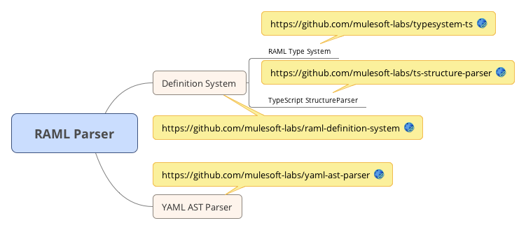

# RAML 1.0 JS Parser <sup>(beta)</sup>

See http://raml.org for more information about RAML.

This parser is at a beta state of development, as part of the API Workbench development cycle (http://apiworkbench.com).

## Installation
```
npm install raml-1-parser

node node_modules/raml-1-parser/test/test01.js  //synchronously loads XKCD API from local file system and prints its JSON representation
node node_modules/raml-1-parser/test/testAsync01.js  //asynchronously loads XKCD API from local file system and prints its JSON representation
node node_modules/raml-1-parser/test/test02.js  //synchronously loads XKCD API from github and prints its JSON representation
node node_modules/raml-1-parser/test/testAsync02.js  //asynchronously loads XKCD API from github and prints its JSON representation


```

## Usage
* For parser usage example refer to `node_modules/raml-1-parser/test/test.js`
* For asynchrounous usage example refer to `node_modules/raml-1-parser/test/testAsync.js`

Parser documentation: https://raml-org.github.io/raml-js-parser-2/

Getting started guide: https://github.com/raml-org/raml-js-parser-2/blob/master/documentation/GettingStarted.md

## Creating standalone browser package

Clone repository: `clone repository using git`, call `npm install -d`

Build : `npm run build`

Create browser package: `npm run generateBrowserVersion`, this will generate the package in `browserVersion` folder.

##Setting development environment:

In order to setup development environment you also need to install and `npm link` RAML dependencies from the corresponding repositories.



How to test: `gulp test`