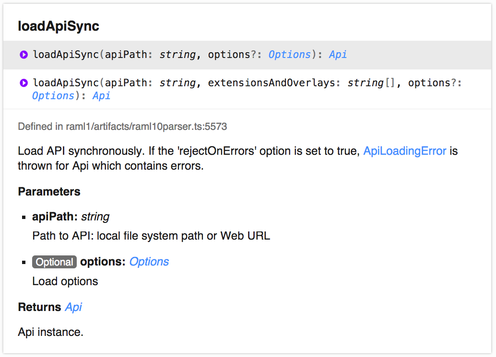
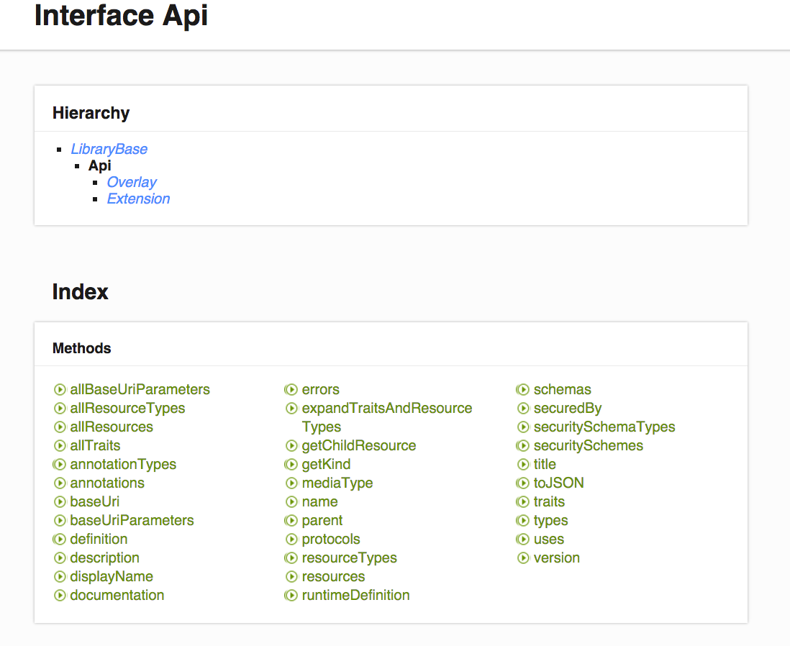
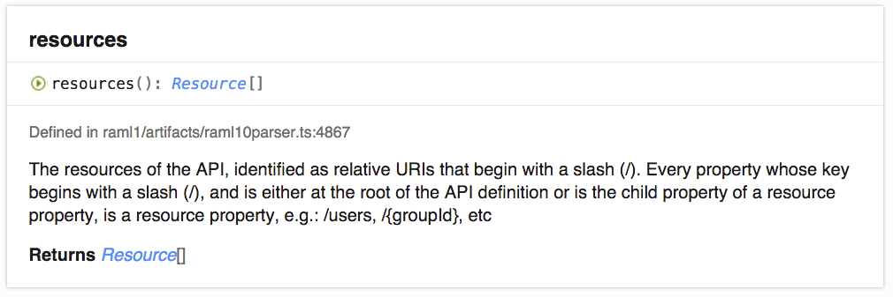
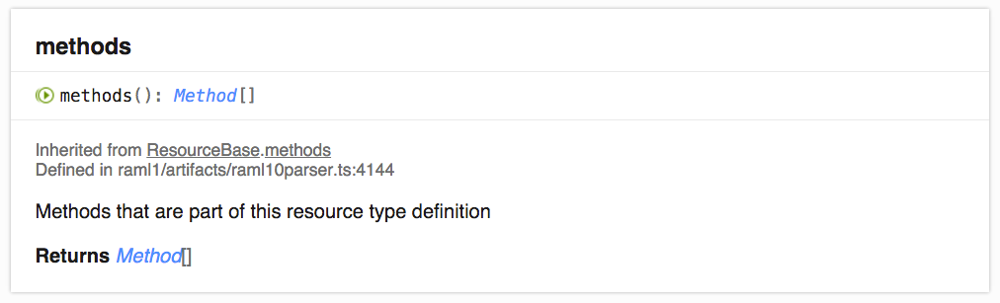
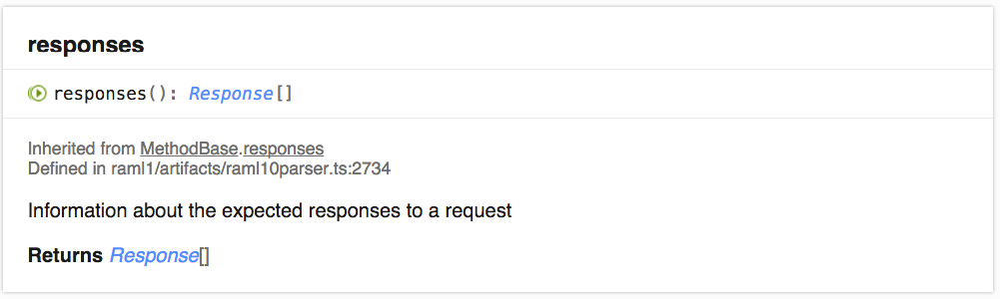
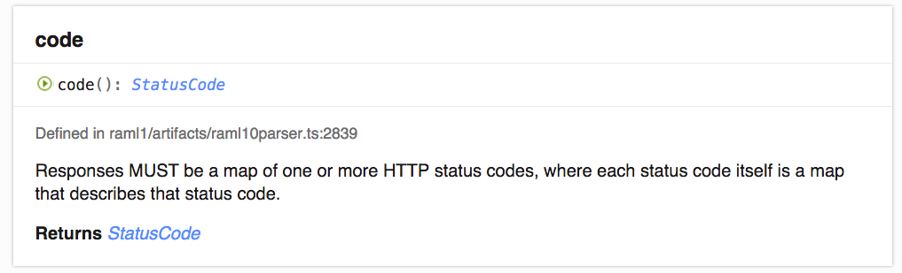
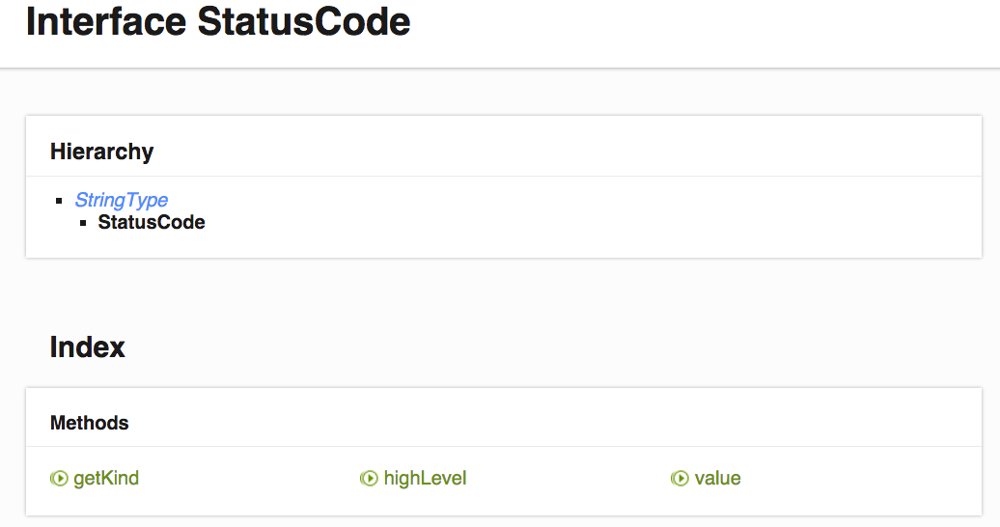
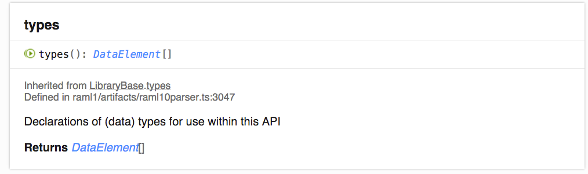
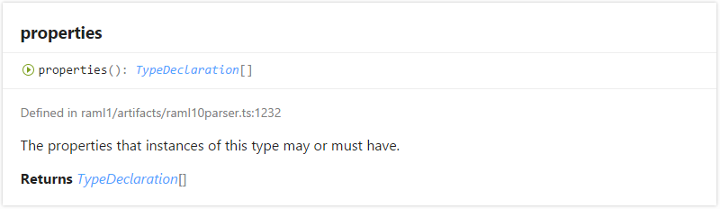

# Getting Started

## Intro

This document is intended to provide an initial knowledge of how to use RAML 1.0 JavaScript parser.

## Installation

###	Pre-required software

1.	[NodeJS](https://nodejs.org/en/download/)
2.	Install [git](https://git-scm.com/downloads)

###	RAML 1.0 JavaScript parser installation

NPM installation is recommended, but taking a quick look at the parser can be done via repository cloning.

#### Cloning Repository

Run the following command-line instructions:

```
git clone https://github.com/raml-org/raml-js-parser-2

cd raml-js-parser-2

npm install typescript // This line is temporary and required only to workaround a bug. To remove.

npm install
```

Quick tests:

```
node test/test.js  //here you should observe JSON representation of XKCD API in your console

node test/testAsync.js  //same as above but in asynchronous mode
```

If there are no any exceptions, RAML JS Parser is installed successfully

#### NPM installation

Run command line tool and create a folder where all you test files will be stored.


Run `npm init`

Run `npm install raml-1-parser --save` and wait while all the dependencies are downloaded
and properly initialized.

Run ```node node_modules/raml-1-parser/test/test01.js```. If there are no any exceptions, RAML JS Parser is installed successfully

## Creating test files

These instructions assume that JS Parser was installed via NPM.

Use your favorite text editor to create `getting_started.js` JS file in root of the module and add require instruction like that:

```js
// step1
var raml = require("raml-1-parser");
```

Create `test.raml` file in the same folder with the following contents:
```RAML
#%RAML 1.0
title: Pet shop
version: 1
baseUri: /shop

types:
  Pet:
    properties:
      name: string
      kind: string
      price: number
    example:
      name: "Snoopy"
      kind: "Mammal"
      price: 100

/pets:
  get:
    responses:
      200:
        body:
          application/json:
            type: Pet[]
  post:
    body:
      application/json:
        type: Pet
  /{id}:
    put:
      body:
        application/json:
          type: Pet
    delete:
      responses:
        204:

```

To do this, create your RAML 1.0 file using Atom editor with installed [apiworkbench plugin](http://apiworkbench.com/).

Edit your `getting_started.js` file to include RAML file loading:
```js
// step2
var fs = require("fs");
var path = require("path");

// Here we create a file name to be loaded
var fName = path.resolve(__dirname, "test.raml");

// Parse our RAML file with all the dependencies
var api = raml.loadApiSync(fName);
console.log(JSON.stringify(api.toJSON(), null, 2));

```

Run ```node getting_started.js``` again. If you see the JSON reflecting RAML file AST in the output, then RAML was parsed correctly.
`toJSON` method is a useful tool for debugging, but should not be relied upon by JS RAML Parser users to actually analyze and modify RAML AST.

## Basics of parsing

`api` variable stores the root of AST. Its children and properties can be traversed and analyzed to find out the structure of RAML file.

Open `documentation` folder in the root of the cloned repository and open index.html file in web browser.

`loadApiSync` function we just used to parse RAML is described there:



As it is a global function of parser module, we are calling it like that:
`raml.loadApiSync(fName)`, and is it returns `Api`.

Documentation displays, that `loadApiSync` returns `Api` object, so click it and see the details:



Lets check `resources()` method first:



We see that it returns an array of resources, and each resource contains some methods in turn:


Lets try checking resources and printing them in a simple way. Remove `console.log(JSON.stringify(api.toJSON(), null, 2));` line from `getting_started.js` code and add the following:

```js
var apiResources = api.resources();
apiResources.forEach(function (resource) {
    console.log(resource.kind() + " : " + resource.absoluteUri());
});
```

The output is:
```
Resource : /shop/pets
```

Here, the `getKind()` method, which most of AST nodes have, will name what you have at hands, and `absoluteUri()` can be found in `Resource` documentation.

But why only `/shop/pets` is listed, and `/shop/pets/{id}` is not? Because AST is hierarchical, so `API` only has `/shop/pets` as a direct child, and `/shop/pets/{id}` is a child of `/shop/pets`.

Lets see if we can modify our code to print the whole resource tree:

```js
var raml = require("raml-1-parser");
var fs = require("fs");
var path = require("path");

// Here we create a file name to be loaded
var fName = path.resolve(__dirname, "test.raml");

// Parse our RAML file with all the dependencies
var api = raml.loadApiSync(fName);

/**
 * Process resource (here we just trace different paramters of URL)
 **/
function processResource(res) {
    // User-friendly name (if provided)
    if (res.displayName()) {
        console.log(res.displayName());
    }

    // Trace resource's relative URI
    var relativeUri = res.relativeUri().value();
    // Next method returns full relative URI (which is equal with previous one
    // for top-level resources, but for subresources it returns full path from the
    // resources base URL)
    var completeRelativeUri = res.completeRelativeUri();
    // trace both of them
    console.log(completeRelativeUri, "(", relativeUri, ")");

    // Let's enumerate all URI parameters
    for (var uriParamNum = 0; uriParamNum < res.allUriParameters().length; ++uriParamNum) {
        var uriParam = res.allUriParameters()[uriParamNum];
        // Here we trace URI parameter's name and types
        console.log("\tURI Parameter:", uriParam.name(), uriParam.type().join(","));
    }

    // Recursive call this function for all subresources
    for (var subResNum = 0; subResNum < res.resources().length; ++subResNum) {
        var subRes = res.resources()[subResNum];
        processResource(subRes);
    }
}

// Enumerate all the resources
for (var resNum = 0; resNum < api.resources().length; ++resNum) {
    processResource(api.resources()[resNum]);
}
```

The output is following:
```
/pets ( /pets )
/pets/{id} ( /{id} )
	URI Parameter: id string
```

Here, we use recursion to traverse resources, and for each resource print its `completeRelativeUri`, `relativeUri`, and `allUriParameters`. The description of each method can be found in documentation of `Resource` type.

Of course if we do not want to traverse the tree manually, we can find all kinds of useful helpers in documentation, like `allResources` method of `API`, which traverses the tree for you and finds all resources.

Lets print all the methods in that way, but first lets check `methods` documentation:


Replace everything under
```js
var api = raml.loadApiSync(fName);
```
line with the following:

```js
api.allResources().forEach(function (resource) {

    console.log(resource.absoluteUri())

    resource.methods().forEach(function(method){
        console.log("\t"+method.method())
    })
})
```

The output:
```
/shop/pets
	get
	post
/shop/pets/{id}
	put
	delete
```

`method` method of `Method` class prints HTTP type of the method.

We can also see the `responses` method in `Method` documentation:



Lets print the responses too:
```js
api.allResources().forEach(function (resource) {

    console.log(resource.absoluteUri())

    resource.methods().forEach(function(method){
        console.log("\t"+method.method())

        method.responses().forEach(function (response) {
            console.log("\t\t" + response.code().value())
        })
    })
})
```

The output is:
```
/shop/pets
	get
		200
	post
/shop/pets/{id}
	put
	delete
		204
```

To be able to print that, we first used `code()` method of `Response`:



And then found `value()` method in `StatusCodeString` description:



All in all, the AST tree reflects RAML structure, so starting from `loadApiSync` global method, then checking documentation for its return value, proceeding to its methods and doing that recursively allows reaching everything.

## Resource Types and Traits

This section describes how to analyze resource types. Traits are analyzed in the same way.

### Expanding AST

Lets change our RAML file to look like this:

```RAML
#%RAML 1.0
title: Pet shop
version: 1
baseUri: /shop

types:
  Pet:
    properties:
      name: string
      kind: string
      price: number
    example:
      name: "Snoopy"
      kind: "Mammal"
      price: 100

resourceTypes:

  Collection:
    get:
      responses:
        200:
          body:
            application/json:
              type: Pet[]
    post:
      body:
        application/json:
          type: Pet

  Member:
    put:
      body:
        application/json:
          type: Pet
    delete:
      responses:
        204:

/pets:
  type: Collection

  /{id}:
    type: Member

```

It differs from the previous sample by method declarations being moved to resource types, the real resources and methods structure remains the same.

Now change `getting_started.js` contents:
```js
var raml = require("raml-1-parser");
var fs = require("fs");
var path = require("path");

// Here we create a file name to be loaded
var fName = path.resolve(__dirname, "test.raml");

// Parse our RAML file with all the dependencies
var api = raml.loadApiSync(fName).expand();

api.allResources().forEach(function (resource) {

    console.log(resource.absoluteUri())

    resource.methods().forEach(function(method){
        console.log("\t"+method.method())

        method.responses().forEach(function (response) {
            console.log("\t\t" + response.code().value())
        })
    })
})

```

And launch it.

Results are:

```
/shop/pets
	get
		200
	post
/shop/pets/{id}
	put
	delete
		204
```

So when RAML JS Parser is asked to expand traits and types, you get them applied automatically and have the final structure at hands.

If you change the API loading call to
```js
var api = raml.loadApiSync(fName);
```
the output will look like:

```
/shop/pets
/shop/pets/{id}
```

So without resource type expansion the methods and other contents from resource types are not added to the point of the AST, they are applied to.

### Getting the name of resource type from its application

We can see the resource type applications itself:

```js
var resourceTypeValue = api.allResources()[0].type().value().valueName()
console.log(resourceTypeValue)
```

Here we take the `/pets` resource, getting its type and printing the value of the type.

The output is:
```
Collection
```

### Getting resource type application parameter values

This can be done with both expanded and unexpanded AST.

Why did we have to call `valueName()` method after calling `value()`, why not just make `value()` to return the type name?

The answer is: the resource type appliance may also have parameters.

Right now it is hard to obtain the parameters at the top level of AST, but going one level down to high-level AST allows that. This should be exposed at top level AST in the nearest future. The current code below will continue to work, but there will be more suitable helpers available at the top level regarding this matter.

TODO: rewrite this part when structured values are wrapped at top level of AST.

Change the RAML file like following:

```RAML
#%RAML 1.0
title: Pet shop
version: 1
baseUri: /shop

types:
  Pet:
    properties:
      name: string
      kind: string
      price: number
    example:
      name: "Snoopy"
      kind: "Mammal"
      price: 100

resourceTypes:

  Collection:
    get:
      responses:
        200:
          body:
            application/json:
              type: <<item>>[]
    post:
      body:
        application/json:
          type: <<item>>

  Member:
    put:
      body:
        application/json:
          type: <<item>>
    delete:
      responses:
        204:

/pets:
  type: { Collection: {item: Pet} }

  /{id}:
    type: { Member: {item : Pet} }

```

In this example we made both resource types to have a type parameter.
In case of `/pets` resource, which refers `Collection` resource type, the `item` parameter value is `Pet`.

Change `getting_started.js` like following:
```js
var raml = require("raml-1-parser");
var fs = require("fs");
var path = require("path");

// Here we create a file name to be loaded
var fName = path.resolve(__dirname, "test.raml");

// Parse our RAML file with all the dependencies
var api = raml.loadApiSync(fName);

var resourceTypeReference = api.allResources()[0].type().value()
var highLevelASTNode = resourceTypeReference.toHighlevel()

highLevelASTNode.attrs().forEach(function (attribute) {
    console.log(attribute.name() + " = " + attribute.value())
})
```

Here we call `toHighlevel()` method, which is available for every top-level AST node and get the high-level node, then print its attributes. High-level nodes do not have have its data wrapped to user-friendly helper methods, instead they have attributes and children.

The output is the following:
```
key = Collection
item = Pet
```

So the `item` parameter value `Pet` is available.

As soon as navigation module is published, it will be possible to directly jump from this resource type appliance to `Collection` resource type declaration as we do in API Workbench.

For now, lets see how resource type declarations can be access directly from API:

### Getting resource type declarations

Modify `getting_started.js` file contents in the following way:

```js
var raml = require("raml-1-parser");
var fs = require("fs");
var path = require("path");

// Here we create a file name to be loaded
var fName = path.resolve(__dirname, "test.raml");

// Parse our RAML file with all the dependencies
var api = raml.loadApiSync(fName);


api.resourceTypes().forEach(function (resourceType) {
    console.log(resourceType.name())
})
```

Here we ask API for resource type declarations and print type names.

The output:
```
Collection
Member
```

And now we will print methods and responses for each resource type the same way we did previously for API:
```js
api.resourceTypes().forEach(function (resourceType) {
    console.log(resourceType.name())

    resourceType.methods().forEach(function(method){
        console.log("\t"+method.method())

        method.responses().forEach(function (response) {
            console.log("\t\t" + response.code().value())
        })
    })
})
```

The output:

```
Collection
	get
		200
	post
Member
	put
	delete
		204
```

## Types

Consider the following RAML specification:

```
#%RAML 1.0
title: Pet shop
version: 1
baseUri: /shop

types:

  Metrics:
    properties:
      height: number
      width: number
      length: number
      weight: number

  Pet:
    properties:
      name: string
      kind: string
      price: number
      metrics?: Metrics
      color:
        enum:
          - Black
          - White
          - Colored
    example:
      name: "Snoopy"
      kind: "Mammal"
      price: 100
      color: Black

  Mammal:
    type: Pet

  Bird:
    type: Pet
    properties:
      wingLength: number
      
  PetCollection: Pet[]

  RandomPet: Mammal|Bird
```

In order to extract AST nodes, which describe types, we can use `Api.types()` method, returning an array of `TypeDeclaration`:



`TypeDeclaration` is the root of the hierarchy for AST type declarations:


In the hierarchy, `ObjectTypeDeclaration` is basically RAML object type, `StringTypeDeclaration` is a string, `NumberTypeDeclaration` is a number, `UnionTypeDeclaration` represents a union type etc.

Now we can print all the type names names using the `TypeDeclaration.name` method:

```js
api.types().forEach(function (type) {
	console.log(type.name());
});
```
Output is:

```
Metrics
Pet
Mammal
Bird
PetCollection
RandomPet
```

Lets now print types of AST nodes representing the types:

```js
api.types().forEach(function (type) {
    console.log(type.name() + " : " + type.kind());
});
```

Output:

```
Metrics : ObjectTypeDeclaration
Pet : ObjectTypeDeclaration
Mammal : ObjectTypeDeclaration
Bird : ObjectTypeDeclaration
PetCollection : ArrayTypeDeclaration
RandomPet : UnionTypeDeclaration
```

###Nominal Type System

Apart from AST, the parser provides one more way of representing types: nominal type system. Nominal type system has several advantages in comparison with AST: it allows to

* explore type hierarchy in a natural way
* obtain consistent object representations for component types of arrays and union types.

Having a `TypeDeclaration` instance in hands one can obtain a nominal type by means of `TypeDeclaration.localType()` method returning `ITypeDefinition`:


`ITypeDefinition` has several subtypes:


* `IAnnotationType` is used to represent annotation types
* `IArrayType` is used to represent array types
* `IExternalType` is used to represent types defined by XML and JSON schemas
* `IUnionType` is used to represent union types
* `IValueTypeDefinition` is used to represent scalar types

`ITypeDefinition` has a set of methods which allow to check type is annotation, array type, etc:

* `isAnnotationType`
* `isArray`
* `isExternal`
* `isObject`
* `isUnion`
* `isValueType`

Lets print nominal type names for our types:

```js
api.types().forEach(function(type){
    var typeName = type.localType().nameId();
    console.log(typeName);
});
```

output:
```
Metrics
Pet
Mammal
Bird
PetCollection
RandomPet
```

###Supertypes and Subtypes
The `TypeDeclaration.type()` method provides information about extended types. It returns an array os strings which are either names of supertypes or expressions which defines supertypes.

```js
api.types().forEach(function (type) {

    console.log(type.name() + " : " + type.kind());
    console.log("\t type:", type.type())

});
```

Output:

```
Metrics : ObjectTypeDeclaration
	 type: [ 'object' ]
Pet : ObjectTypeDeclaration
	 type: [ 'object' ]
Mammal : ObjectTypeDeclaration
	 type: [ 'Pet' ]
Bird : ObjectTypeDeclaration
	 type: [ 'Pet' ]
PetCollection : ArrayTypeDeclaration
	 type: [ 'Pet[]' ]
PetCollection2 : ArrayTypeDeclaration
	 type: [ 'array' ]
RandomPet : UnionTypeDeclaration
	 type: [ 'Mammal|Bird' ]
```

One need a special type registry in order to explore type hierarchy using AST as it provides only names of supertypes or expressions which define them.

In contrast to the AST, the nominal type system allows to explore hierarchy without involving auxiliary services. In order to obtain all direct supertypes of the type you should call the `ITypeDefinition.superTypes()` method. It returns an array of `ITypeDefinition` instances which can be treated just the same way as the one the method has been called for.

Let's list complete hierarchy for each of our types:

```js
function printHierarchy(nominalType,indent){
    indent = indent || "";
    var typeName = nominalType.nameId();
    console.log(indent + typeName);
    nominalType.superTypes().forEach(function(st){
        printHierarchy(st, indent + "  ");
    });
}

api.types().forEach(function(type){
    printHierarchy(type.localType());
    console.log("---");
});
```
output:
```
Metrics
  object
    any
---
Pet
  object
    any
---
Mammal
  Pet
    object
      any
---
Bird
  Pet
    object
      any
---
PetCollection
  array
    any
---
RandomPet
  union
    any
---
```
In case you need a complete set of supertypes including direct and indirect ones, you should call the `ITypeDefinition.allSuperTypes()` method.

The `ITypeDefinition.isAssignableFrom()` method is used to check if one type inherits another or coincides with it. Lets check each of our type whether it inherits or coincides with `Pet` type:
```
console.log("Is the type assignable from \"Pet\" type?")
api.types().filter(function(type){
    console.log(type.name(),":",type.localType().isAssignableFrom("Pet"));
});
```
output:
```
Is the type assignable from "Pet" type?
Metrics : false
Pet : true
Mammal : true
Bird : true
PetCollection : false
RandomPet : false
```

In order to obtain direct subtypes of the type, you should call the `ITypeDefinition.subTypes()` method which returns an array of `ITypeDefinition` instances. Lets list all the direct subtypes of the `Pet` type:
```
api.types().filter(function(type){
    return type.name()=="Pet"
}).forEach(function(type){
    console.log("Subtypes of", type.name(), ":");
    type.localType().subTypes().forEach(function(st){
        console.log(st.nameId());
    });
});
```
output:
```
Subtypes of Pet :
Mammal
Bird
```

In case you need a complete set of subtypes including direct and indirect ones, you should call the `ITypeDefinition.allSubTypes()` method.

###Properties of Object Types

Properties of `ObjectTypeDeclaration` can be obtained by means of `properties` method, which returns an array of `TypeDeclaration`:



So we can print property names and their own types for each type:

```js
api.types().forEach(function (type) {

    console.log(type.name() + " : " + type.kind());
	if(type.kind()=="ObjectTypeDeclaration"){
        type.properties().forEach(function(prop) {
            console.log("\t", prop.name() + " : " + prop.kind());
        });
    }

});
```

Output:

```
Metrics : ObjectTypeDeclaration
	 height : NumberTypeDeclaration
	 width : NumberTypeDeclaration
	 length : NumberTypeDeclaration
	 weight : NumberTypeDeclaration
Pet : ObjectTypeDeclaration
	 name : StringTypeDeclaration
	 kind : StringTypeDeclaration
	 price : NumberTypeDeclaration
	 metrics : ObjectTypeDeclaration
	 color : StringTypeDeclaration
Mammal : ObjectTypeDeclaration
Bird : ObjectTypeDeclaration
	 wingLength : NumberTypeDeclaration
PetCollection : ArrayTypeDeclaration
RandomPet : UnionTypeDeclaration
```

The `color` property has enum facet defined. We can detect and print that:

```js
api.types().forEach(function (type) {

    console.log(type.name() + " : " + type.kind());

    if(type.kind()=="ObjectTypeDeclaration"){
        type.properties().forEach(function(prop) {
            console.log("\t", prop.name() + " : " + prop.kind());
            if (prop.kind()=="StringTypeDeclaration" && prop.enum()) {
                prop.enum().forEach(function(enumValue){
                    console.log("\t\t-", enumValue);
                })
            }
        });
    }
});
```

Output:

```
Metrics : ObjectTypeDeclaration
	 height : NumberTypeDeclaration
	 width : NumberTypeDeclaration
	 length : NumberTypeDeclaration
	 weight : NumberTypeDeclaration
Pet : ObjectTypeDeclaration
	 name : StringTypeDeclaration
	 kind : StringTypeDeclaration
	 price : NumberTypeDeclaration
	 metrics : ObjectTypeDeclaration
	 color : StringTypeDeclaration
		- White
		- Black
		- Colored
Mammal : ObjectTypeDeclaration
Bird : ObjectTypeDeclaration
	 wingLength : NumberTypeDeclaration
PetCollection : ArrayTypeDeclaration
RandomPet : UnionTypeDeclaration
```

As AST does not allow to directly retrieve full information about object property types, it's one more cases of nominal type system being useful.
Let print hierarchy and properties for nominal type of the `Pet.metrics` property:
```js
function printHierarchyAndProperties(nominalType,indent){
    indent = indent || "";
    var typeName = nominalType.nameId();
    console.log(indent + "type: " + typeName + " (" + nominalType.kind() + ")");
    if(nominalType.isAssignableFrom("object") && nominalType.properties().length>0) {
        console.log(indent + "  properties:");
        nominalType.properties().forEach(function (prop) {
            console.log(indent + "    " + prop.nameId() + ": " + prop.range().nameId());
        });
    }
    if(nominalType.superTypes().length>0) {
        console.log(indent + "  supertypes:");
        nominalType.superTypes().forEach(function (st) {
            printHierarchyAndProperties(st, indent + "    ");
        });
    }
}

api.types().filter(function(type){return type.name()=="Pet"})
    .forEach(function (type) {

        type.properties().filter(function(prop){return prop.name()=="metrics"})
            .forEach(function(prop) {
                var localType = prop.localType();
                printHierarchyAndProperties(localType);
            });
    });
```
output:
```
type: metrics (object)
  supertypes:
    type: Metrics (object)
      properties:
        height: NumberType
        width: NumberType
        length: NumberType
        weight: NumberType
      supertypes:
        type: object (object)
          supertypes:
            type: any (object)
```
The nominal type has the same name as the property and has property type as supertype. The picture looks more natural, if we switch to nominal type system directly from AST node of the type itself:

```js
api.types().filter(function(type){return type.name()=="Pet"})
    .forEach(function (type) {

        var localType = type.localType();
        var nominalProp = localType.property("metrics");
        var propertyRange = nominalProp.range();

        console.log(nominalProp.domain().nameId()+"."+nominalProp.nameId()+" range details:")
        printHierarchyAndProperties(propertyRange);
});
```
output:
```
Pet.metrics range details:
type: Metrics (object)
  properties:
    height: NumberType
    width: NumberType
    length: NumberType
    weight: NumberType
  supertypes:
    type: object (object)
      supertypes:
        type: any (object)
```

Thus, the `ITypeDefinition.properties()` returns a set of properties declared by the type itself, represented as an array of `IProperty`. In order to obtain a set of properties declared by a type and all its supertypes, you should use the `ITypeDefinition.allProperties()` method.  

`IProperty.nameId()` method returns name of the property, `IProperty.range()` returns property value type represented as `ITypeDefinition` instance, and `IProperty.domain()` returns type declaring the property represented as `ITypeDefinition` instance.

### Array Types

Component type of `ArrayTypeDeclaration` can be obtained by means of the `items` method:


Let's print component type of the PetCollection array type:
```js
api.types().forEach(function (type) {

    if(type.kind() == 'ArrayTypeDeclaration') {
        console.log(type.name() + " : " + type.kind());
        console.log("\t", "items : ", type.items().kind());
    }

});
```

output:
```
PetCollection : ArrayTypeDeclaration
	 items :  ObjectTypeDeclaration
```

As in case with property types, AST does not allow to directly inspect component type details. Thus, we have to switch to nominal type system.
Nominal type of array types is represented as `IArrayType` instance.
The code below prints details for array type component types:
```js
api.types().filter(function(type){return type.kind()=="ArrayTypeDeclaration"})
    .forEach(function (type) {

    var localType = type.items().localType();
    console.log(type.name() + " component details:");
    printHierarchyAndProperties(localType);
});
```
output:
```
PetCollection component details:
type: Pet (object)
  properties:
    name: StringType
    kind: StringType
    price: NumberType
    metrics: Metrics
    color: null
  supertypes:
    type: object (object)
      supertypes:
        type: any (object)
```

The reason of the `color` property type having `null` type name is that its type is anonymous.


Once again, the same result can be achieved by switching to nominal type system right from the types AST node. The method for retrieving
nominal array type component is `IArrayType.componentType()`.
```js
api.types().filter(function(type){return type.kind()=="ArrayTypeDeclaration"})
    .forEach(function (type) {

    var localType = type.localType().componentType();
    console.log(type.name() + " component details:");
    printHierarchyAndProperties(localType);
});
```
output:
```
PetCollection component details:
type: Pet (object)
  properties:
    name: StringType
    kind: StringType
    price: NumberType
    metrics: Metrics
    color: null
  supertypes:
    type: object (object)
      supertypes:
        type: any (object)
```

###Union Types
Nominal type of union types is represented as `IUnionType` instance. The `IUnionType.leftType()` and `IUnionType.rightType()` methods allow inspection
union type components:

```js
api.types().filter(function(type){return type.localType().isUnion()})
    .forEach(function (type) {

    var localType = type.localType();
    console.log(localType.nameId() + " components:");
    console.log("left:");
    //See "Properties of Object Types" section for "printHierarchyAndProperties" definition
    printHierarchyAndProperties(localType.leftType(), "  ");
    console.log("right:");
    printHierarchyAndProperties(localType.rightType(), "  ");
});
```
output:
```
RandomPet components:
left:
  type: Mammal (object)
    supertypes:
      type: Pet (object)
        properties:
          name: StringType
          kind: StringType
          price: NumberType
          metrics: Metrics
          color: null
        supertypes:
          type: object (object)
            supertypes:
              type: any (object)
right:
  type: Bird (object)
    properties:
      wingLength: NumberType
    supertypes:
      type: Pet (object)
        properties:
          name: StringType
          kind: StringType
          price: NumberType
          metrics: Metrics
          color: null
        supertypes:
          type: object (object)
            supertypes:
              type: any (object)
```


###Body Types

Consider the following method:
```
/pets:
  post:
    body:
      application/json:
        type: Pet
        properties:
          tailLength: number
```

Method body can be obtained as follows:

```js
api.resources().filter(function(resource){return resource.relativeUri().value()=="/pets"})
    .forEach(function(resource){

        resource.childMethod("post").forEach(function(method) {
            var bodyTypes = method.body();
            bodyTypes.forEach(function (body) {
                console.log("name:", body.name());
                console.log("type:", body.type());
                console.log("properties:");
                body.properties().forEach(function (prop) {
                    console.log(" ", prop.name(), ":", prop.type());
                });
            });
        });
});
```
output:
```
name: application/json
type: [ 'Pet' ]
properties:
  tailLength : [ 'number' ]
```
Thus, body type has body media type as name and inherits type specified in `type` property. Lets see it again with the help of nominal type system:
```js
api.resources().filter(function(resource){return resource.relativeUri().value()=="/pets"})
    .forEach(function(resource){
    resource.childMethod("post").forEach(function(method) {
        var bodyTypes = method.body();
        bodyTypes.forEach(function (body) {
        //See "Properties of Object Types" section for "printHierarchyAndProperties" definition
            printHierarchyAndProperties(body.nominalType());
        });
    });
});
```
output:
```
type: application/json (object)
  properties:
    tailLength: NumberType
  supertypes:
    type: Pet (object)
      properties:
        name: StringType
        kind: StringType
        price: NumberType
        metrics: Metrics
        color: null
      supertypes:
        type: object (object)
          supertypes:
            type: any (object)
```

###Facets

Facets can be interpreted as static properties of type. If a type defines a facet, each of its direct subtypes must fix the facet, i.e. provide a value for it. Facets are defined just the same way as RAML types. Example of string facet definition and fixing can be seen in the following RAML specification:
```
#%RAML 1.0
title: Facets
version: 1
baseUri: /facets

types:
  User:
    properties:
      id: number
      name:

    facets:
      #definition of string facet "role"
      role:

  Manager:
    type: User
    #fixing the "role" facet
    role: manager
    properties:
      team: User[]

  Admin:
    type: User
    #fixing the "role" facet
    role: admin
    properties:
      phoneNumber: string
```

Facets defined by the type can be obtained by `TypeDeclaration.facets()` method returning an array of `TypeDeclaration` instances, and a set of fixed facet values can be obtained by `TypeDeclaration.fixedFacets()` method returning a `TypeInstance`. This `TypeInstance` can be called the `toJSON()` method in order to be turned to object which map facet names to their values.

```js
api.types().forEach(function(type){

    console.log(type.name(), ":");
    if(type.facets().length>0){
        console.log("defined facets:");
        type.facets().forEach(function(t){
            console.log(t.name(),":",t.type());
        });
    }
    if(type.fixedFacets()){
        console.log("fixeded facets:",
            JSON.stringify(type.fixedFacets().toJSON(),null,2));
    }
    console.log();
});
```
output:
```
User :
defined facets:
role : [ 'string' ]

Manager :
fixeded facets: {
  "role": "manager"
}

Admin :
fixeded facets: {
  "role": "admin"
}

```
The same result can be achieved by means of nominal type system.
A set of facets declared by the type itself can be retrieved by the `ITypeDefinition.facets()` returning an array of `IProperty`.
If you need a set of facets declared by type and all of its supertypes, you should use the `ITypeDefinition.allFacets()` method.
A set of type fixed facet values can be retrieved by the `ITypeDefinition.getFixedFacets()` method returning actual values used to fix facets.

```js
api.types().forEach(function(type){

    var nominalType = type.localType();
    console.log(nominalType.nameId(), ":");
    if(nominalType.facets().length>0){
        console.log("defined facets:");
        nominalType.facets().forEach(function(f){
            console.log(f.nameId(),":",f.range().nameId());
        });
    }
    if(Object.keys(nominalType.getFixedFacets()).length>0){
        console.log("fixeded facets:",
            JSON.stringify(nominalType.getFixedFacets(),null,2));
    }
    console.log();
});
```
output:
```
User :
defined facets:
role : StringType

Manager :
fixeded facets: {
  "role": "manager"
}

Admin :
fixeded facets: {
  "role": "admin"
}
```

All the above sets of facets contain user defined facets, but not the built in facets.


##Annotations

In order to extract AST nodes, which describe annotaton types, we can use `Api.annotationTypes()` method, returning an array of `AnnotationTypeDeclaration`:


`AnnotationTypeDeclaration` is the root of the hierarchy for AST type declarations:


Each `AnnotationTypeDeclaration` subtype inherits corresponding `TypeDeclaration` subtype. For example, `ObjectAnnotationTypeDeclaration`
inherits `ObjectTypeDeclaration`, `ArrayAnnotationTypeDeclaration` inherits `ArrayTypeDeclaration` etc. Thus annotation type AST nodes can be treated just the same way as AST nodes of types.

Consider the following RAML specification:
```
#%RAML 1.0
title: Annotations
version: v1
baseUri: /annotations

annotationTypes:

  MyStringAnnotation:
    enum: [ value1, value2, value3 ]

  MyObjectAnnotation:
    properties:
      property1: string
      property2: boolean
```

Lets print some details about each of our annotation types:

```
api.annotationTypes().filter(function(aType){
    return aType.name()=="MyStringAnnotation"
}).forEach(function(aType){

    console.log("annotation type");
    console.log("  name:",aType.name());
    console.log("  type:",aType.type());
    console.log("  enum:",aType.enum());//enum() method is inherited from StringTypeDeclaration
});
api.annotationTypes().filter(function(aType){
    return aType.name()=="MyObjectAnnotation"
}).forEach(function(aType){
    
    console.log("annotation type");
    console.log("  name:",aType.name());
    console.log("  type:",aType.type());
    console.log("  properties:");
    aType.properties().forEach(function(prop){//properties() method is inherited from ObjectTypeDeclaration
        console.log("   ",prop.name(),":",prop.type());
    });
});
```

output:

```
annotation type
  name: MyStringAnnotation
  type: [ 'string' ]
  enum: [ 'value1', 'value2', 'value3' ]
annotation type
  name: MyObjectAnnotation
  type: [ 'object' ]
  properties:
    property1 : [ 'string' ]
    property2 : [ 'string' ]
```

The same operation can be performed by means of nominal type system:
```js
	api.annotationTypes().forEach(function(aType){
	    //see "Supertypes and Subtypes" section of the "Types" chapter
	    //for "printHierarchyAndProperties" definition 
	    printHierarchyAndProperties(aType.localType());
	    console.log();
	});
```

output:
```
type: MyStringAnnotation (annotation)
  supertypes:
    type: MyStringAnnotation (value)
      supertypes:
        type: StringType (value)
          supertypes:
            type: ValueType (value)
            type: scalar (value)
              supertypes:
                type: any (object)

type: MyObjectAnnotation (annotation)
  supertypes:
    type: MyObjectAnnotation (object)
      properties:
        property1: StringType
        property2: StringType
      supertypes:
        type: object (object)
          supertypes:
            type: any (object)

```

Each annotatable RAML element inherits `RAMLLanguageElement`, and it provides its annotations as `RAMLLanguageElement.annotations()`
method value. The method returns an array of annotation references represented as `AnnotationRef` instances.

The `AnnotationRef.annotations()` method is used to retrieve AST node of the referenced annotation. The `AnnotationRef.structuredValue()`
method is used to obtain reference value represented as `TypeInstance` which can be called `toJSON()` method in order to obtain actual value.

Consider the following resource:

```
/resource:
  (MyStringAnnotation): value2
  (MyObjectAnnotation):
    property1: property 1 value
    property2: property 2 value
```

Lets iterate through these annotation references and print their referenced annotations and values:

```js
api.childResource("/resource").annotations().forEach(function(aRef){

    console.log("referenced annotation:");
    //see "Supertypes and Subtypes" section of the "Types" chapter
	//for "printHierarchyAndProperties" definition 
    printHierarchyAndProperties(aRef.annotation().localType());
    console.log("value:", JSON.stringify(aRef.structuredValue().toJSON(),null,2));
    console.log();
});
```

output:

```
referenced annotation:
type: MyStringAnnotation (annotation)
  supertypes:
    type: MyStringAnnotation (value)
      supertypes:
        type: StringType (value)
          supertypes:
            type: ValueType (value)
            type: scalar (value)
              supertypes:
                type: any (object)
value: "value2"

referenced annotation:
type: MyObjectAnnotation (annotation)
  supertypes:
    type: MyObjectAnnotation (object)
      properties:
        property1: StringType
        property2: StringType
      supertypes:
        type: object (object)
          supertypes:
            type: any (object)
value: {
  "property1": "property 1 value",
  "property2": "property 2 value"
}
```
